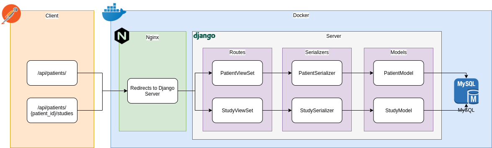

# Senior Backend Developer Challenge

### Take-Home Assignment

## Description

With this exercise, we will evaluate your ability to develop a simple backend application that meets the requirements for an imaginary product we want to build.

Completing this should take you anywhere from a couple of hours to up to a day depending on your level of expertise, available time to focus, and level of detail you consider sufficient.

That said, if it is taking you more than a day, you are probably spending more effort than necessary in some details.
We expect that you submit your final work within one week of receiving the assignment, but please let us know if this is too short notice for you.

Please feel free to reach out and ask questions if you need any clarification.

## Details

### The Application

We are developing a simpler version of our core application. This application handles the information of our patients and the studies they have made.

The following are examples of data to be used:

Table for each patient that has been introduced in the system by a doctor.

Patients (`/api/tests/data/patients.csv`):

```
first_name, last_name, birth_date, email, id
Jose, Villalobos, 1955-04-10, pepe@ejemplo.com, 1
Jessica, Ramirez, 1971-07-01, jessica@ejemplo.com, 2
Diana Laura, Del Toro, 1988-08-29, diana@ejemplo.com, 3
Jorge Alberto, Trevino, 1990-05-05, jorge@ejemplo.com, 4
```

Table for each study made to a patient.

Studies (`/api/tests/data/studies.csv`):

```
urgency_level, body_part, description, type, patient_id
HIGH, STOMACH, NO FINDINGS, XRAY, 1
HIGH, NECK, NORMAL THYROID, XRAY, 1
LOW, CHEST, UNUSUAL RATIO, XRAY, 2
MID, BREASTS, HIGH DENSITY ON LEFT SIDE, MAMMOGRAM, 3
```

## Requirements

As we said before, it can take you a couple of hours or a day.

-   Python 3.8
-   PEP-8 Coding Style
-   Good use of git (commits, pull requests, branches)
-   Use of [conventional commits](https://www.conventionalcommits.org/en/v1.0.0/) for commit messages

1. ✅ Implement the CRUD for Patients
2. ✅ Implement the CRUD for Studies
3. ✅ Implement the a listing view of Patients that displays their Studies
4. ✅ Fix Github Actions workflow for pipeline to work.
5. ✅ Change from `pyenv` and `requirements.txt` to `pipenv` and `Pipfile`
6. ✅ Add a `Dockerfile` and `docker-compose`
7. ✅ Refactor the code
8. ✅ Testing suite

## How to deliver

1. ✅ Clone this repo and share the link with us at the time to deliver (DO NOT FORK)
2. ✅ Please document the repo and your code (using [docstring](https://www.python.org/dev/peps/pep-0257/)
3. ✅ On the README, explain your architecture, and development choices.
4. ✅ On the README, write a summary of what else you could/would like to have done if you had more time.

---

### Makefile useful commands

| Command                  | Description                                                                    |
| ------------------------ | ------------------------------------------------------------------------------ |
| `make start`             | This will create the Django models, migrate, and up the containers             |
| `make install-local`     | This will install dependencies for local development (pipenv and the packages) |
| `make lint-fix`          | Fix the lint errors (run `isort`, `autoflake`, and `black`)                    |
| `make requirements`      | Create a `requirements.txt` file from `Pipfile`                                |
| `make tests`             | Run the tests                                                                  |
| `make coverage-report`   | Check the tests code coverage                                                  |
| `make migrate`           | Make Django migrations (makemigrations, migrate command)                       |
| `make create-superuser`  | Create Django superuser                                                        |
| `make stop-containers`   | Stop project containers (back-challenge-api, back-challenge-proxy)             |
| `make remove-containers` | Remove project containers (back-challenge-api, back-challenge-proxy)           |

## Architecture

### Infraestructure



We have two docker containers:

-   Nginx as Web server.
-   Django as the API server.

### Nginx

Only redirect all the traffic of localhost to the Django API server inside the container in localhost port 5000.

### Django

Serves the API for patients and studies. More info in [API Documentation.md](API%20Documentation.md).

Aditional used packages:

-   Django Rest Framework (DRF): Used for easily create serializers and Api View Sets.
-   DRF Nested Routers: For nest the studies endpoints inside de patient endpoint.
-   Coverage: To check the tests code coverage.
-   Autoflake: To remove unused variables and imports.
-   isort: To sort the imports.

### Main files and directories


| Name              | Description                                                       |
| ----------------- | ----------------------------------------------------------------- |
| `migrations/`     | Store the migrations history                                      |
| `models/`         | Store the app models                                              |
| `routes/`         | Store the app routes (ViewSet)                                    |
| `serializers/`    | Store the app serializers and validators                          |
| `tests/factories` | Store the model factories                                         |
| `tests/models`    | Store the tests of models                                         |
| `tests/routes`    | Store the tests of routes                                         |
| `constants.py`    | Save useful constants                                             |
| `urls.py`         | Register the routes                                               |
| `__init__.py`     | Declare every directory as a package and expose the inner Classes |

## TODOs

-   Change the Database from SQLite to a more robust one (MariaDB, PostgreSQL, SQL Server, etc)
-   Use OpenAPI to build the docs easily.
-   Deploy the project online (DigitalOcean, Heroku, AWS...)
-   Add authentication and authorization for every exposed endpoint
